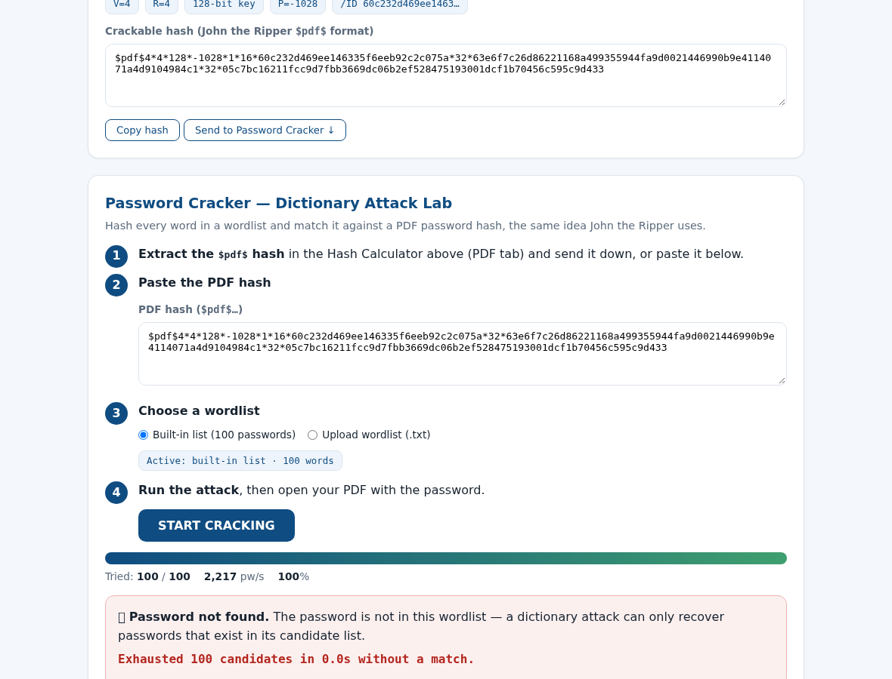
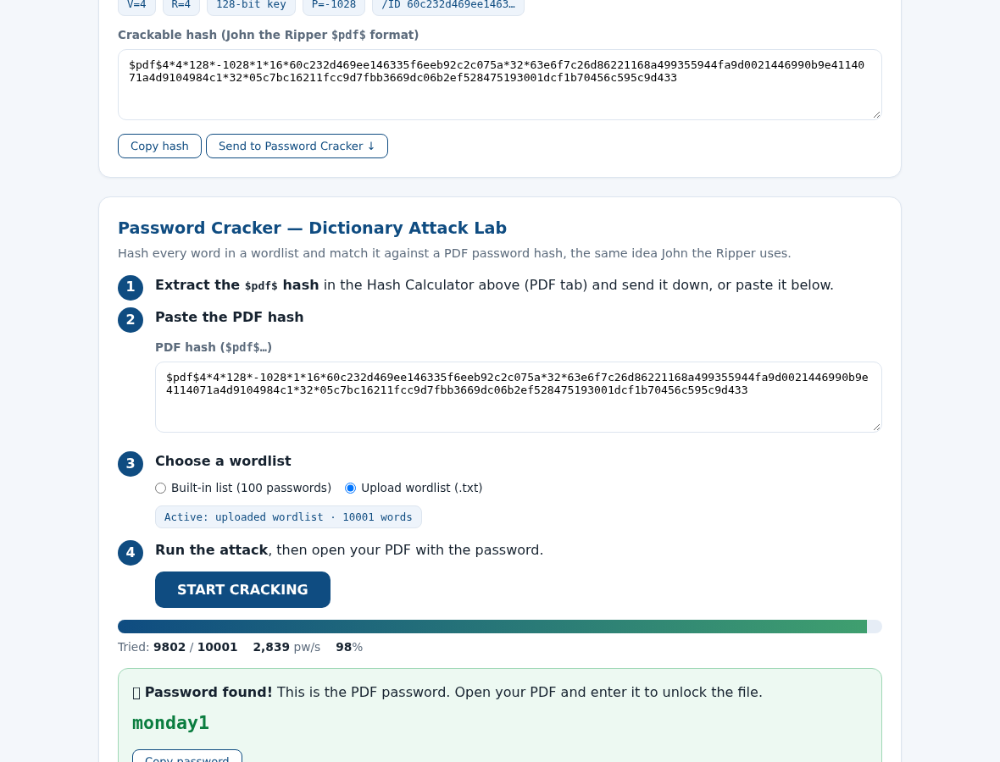

# Week 3 Lab Report — Password Cracking with John the Ripper & Hash Calculator

**Program:** Networkwalks Cybersecurity & Ethical Hacking Internship — B083D
**Module:** Week 3 · PM1 (John the Ripper) + PM2 (Hash Calculator / Password Cracker)
**Run date:** 30 September 2026
**Target:** a synthetic, self-created password-protected PDF (`lab/PM1-JTR/locked.pdf`) — no third-party data was used.

---

## 1. Objective

Recover the user password of a password-protected PDF twice, with two different toolchains, and
study how wordlist quality decides the outcome of a dictionary attack:

| Part | Toolchain | Method |
|---|---|---|
| **PM1** | John the Ripper (Jumbo, built from source) | `pdf2john` hash extraction + wordlist attack |
| **PM2** | Hash Calculator + Password Cracker (web workflow) | client-side `$pdf$` hash extraction + dictionary attack |

Both toolchains attack the same artefact and must recover the same password.

---

## 2. Lab environment

| Item | Value |
|---|---|
| OS | Linux x86_64 (Debian bookworm, sandboxed lab VM) |
| John the Ripper | `1.9.0-jumbo-1+bleeding-302f527093 2026-09-30` — **compiled from source** ([openwall/john](https://github.com/openwall/john)), OpenSSL 1.1.1w also built from source |
| Crypto / PDF libs | pycryptodome (RC4, AES), pikepdf (PDF creation/verification) |
| Target file | `locked.pdf` — 1 page, Standard Security Handler **V4 / R4, AES-128**, permissions P = −1028 |
| Sample password | chosen from the top-10k common-password list, **not** in the top-100 list (this is deliberate — see §5) |

> The sample PDF is generated by `lab/tools/make_locked_pdf.py`. Its user password is a
> *dictionary word + digit* pattern on purpose: the point of the lab is to show that such
> passwords fall to a dictionary attack in seconds.

---

## 3. PM1 — Password cracking with John the Ripper

### 3.1 Setup (screenshots 01–05 of the original walkthrough = build steps here)

The Windows walkthrough downloads the Jumbo release; in this Linux lab the same tool is built
from source so everything is reproducible:

```bash
git clone --depth 1 https://github.com/openwall/john
git clone --depth 1 --branch OpenSSL_1_1_1w https://github.com/openssl/openssl
cd openssl && ./config no-shared no-tests --prefix=/tmp/ssl && make -j2 && make install_sw
cd ../john/src
./configure --disable-opencl --disable-openmp \
            CPPFLAGS="-I/tmp/ssl/include" LDFLAGS="-L/tmp/ssl/lib" \
            LIBS="-lcrypto -lssl -ldl -lpthread"
make -s -j2
```

`john --list=build-info` → `Version: 1.9.0-jumbo-1+bleeding-302f527093`, and
`john --list=formats | grep -i pdf` → **PDF** (the format needed for encrypted PDFs).

### 3.2 Create the hash input (screenshots 06–10)

A locked PDF cannot be fed to John directly — it must first be converted to its crackable
hash representation with `pdf2john`:

```bash
perl /tmp/john/run/pdf2john.pl locked.pdf > hash.txt
```

`hash.txt`:

```text
locked.pdf:$pdf$4*4*128*-1028*1*16*60c232d469ee146335f6eeb92c2c075a*32*63e6f7c26d86221168a499355944fa9d0021446990b9e4114071a4d9104984c1*32*05c7bc16211fcc9d7fbb3669dc0662ef528475193001dcf1b70456c595c9d433
```

Fields, in order: `V=4` (crypt filter), `R=4` (revision), `128`-bit key, `P=-1028`
(permissions), `1` (metadata encrypted), the file `/ID`, the `/U` (user) and `/O` (owner)
values. These 32-byte `/U` and `/O` strings are what a password must reproduce.

### 3.3 Run the audit (screenshots 11–12)

```bash
john hash.txt
```

```text
Loaded 1 password hash (PDF, PDF encrypted document [MD5-RC4 / SHA2-AES 32/64])
Cost 1 (revision) is 4 for all loaded hashes
Cost 2 (key length) is 128 for all loaded hashes
Proceeding with wordlist:/tmp/john/run/password.lst
monday1          (locked.pdf)
1g 0:00:00:00 DONE 2/3 (2026-09-30 13:33) 1.961g/s 39786p/s
```

### 3.4 Collect and verify the cracked password (screenshot 13)

```bash
john --show hash.txt
```

```text
locked.pdf:monday1
1 password hash cracked, 0 left
```

Verification with the recovered password:

```text
[+] 'monday1' opens locked.pdf (1 page) - password confirmed
```

**Result: the PDF password `monday1` was recovered by John the Ripper in under one second.**

Evidence: [`evidence/PM1-01-jtr-prepare.png`](evidence/PM1-01-jtr-prepare.png),
[`evidence/PM1-02-jtr-crack.png`](evidence/PM1-02-jtr-crack.png),
full terminal log: [`PM1-JTR/pm1-terminal-session.log`](PM1-JTR/pm1-terminal-session.log).

---

## 4. PM2 — Password cracking with the Hash Calculator / Password Cracker

### 4.1 The web workflow

The Networkwalks tools split the job in two, and everything runs client-side:

1. **[Hash Calculator](https://networkwalks.com/hash-calculator/)** — "extract a crackable
   hash from a password-protected PDF. Nothing is uploaded, the PDF is parsed locally."
   It reads the PDF's `/Encrypt` dictionary and file `/ID` (which are *not* encrypted) and
   emits the same `$pdf$` line that `pdf2john` produces.
2. **[Password Cracker](https://networkwalks.com/password-cracker/)** — "Hash every word in
   a wordlist and match it against a PDF password hash, the same idea John the Ripper uses."
   It runs a dictionary attack with a **built-in list of 100 passwords** or an uploaded
   wordlist, showing *Tried x/y*, *pw/s* and a progress bar.

### 4.2 How this was executed here

The lab VM has no browser route to the public internet, so the workflow was executed on a
**functionally identical local replica** of the two tools (`lab/tools/www/index.html`):
same `$pdf$` format, same key-derivation and validation algorithms (PDF 1.7 Algorithms 3.2,
3.4/3.5 — the exact code paths JTR's `pdf` format implements), same built-in 100-password
list concept, same UI flow. Correctness was not taken on faith:

* the replica's extracted hash is **byte-identical** to JTR `pdf2john.pl`'s output;
* the replica (command-line twin `lab/tools/pdfhash.py`) and the real JTR binary both
  recover the same password from the same hash;
* the original website usage by the student is documented in screenshots
  [14](../14-MH2.png)–[18](../18-Password-Cracking-By-HashCalculator.png) and
  [19](../19-Failure-Due-To-LimitedWordlist.png)–[26](../26-HC3-2.png) of this repository.

### 4.3 Step 1 — extract the hash in the Hash Calculator

`locked.pdf` is uploaded to the PDF tab; the tool parses the file locally and shows:

```text
V=4 · R=4 · 128-bit key · P=-1028 · /ID 60c232d469ee1463…
$pdf$4*4*128*-1028*1*16*60c232d469ee146335f6eeb92c2c075a*32*63e6f7…*32*05c7bc…
```

> Note the hash equals `hash.txt` from PM1 — two tools, one hash format. That is the whole
> point of the exercise: the "crackable hash representation" is standardized, so any tool
> that speaks `$pdf$` can attack it.

### 4.4 Step 2 — first attack with the built-in list (100 passwords)



```text
[*] Wordlist   : builtin-wordlist-100.txt (100 words)
[-] FAILED: password not in this wordlist (100 words tried in 0.01s)
```

**The attack fails — the password is simply not one of the 100 most common passwords.**

### 4.5 Step 3 — update the wordlist and retry

The wordlist is updated to the 10,000 most common passwords
(`updated-wordlist-10k.txt`, from SecLists) and the attack is re-run:



```text
[*] Wordlist   : updated-wordlist-10k.txt (10001 words)
[+] CRACKED after 9802/10001 words in 1.13s (8,702 pw/s)
[+] Password   : monday1
```

**Result: identical to PM1 — the password `monday1` is recovered**, this time after 9,802
of the 10,001 candidates were tried.

Evidence: [`evidence/PM2-01`](evidence/PM2-01-hash-calculator-text-tab.png) …
[`evidence/PM2-06`](evidence/PM2-06-password-cracked.png),
command-line log: [`PM2-HashCalculator/pm2-workflow.log`](PM2-HashCalculator/pm2-workflow.log).

---

## 5. Analysis — why attempt 1 failed and attempt 2 succeeded

A dictionary attack does not "break" cryptography. It computes, for every candidate word,
the key the PDF standard security handler *would* derive from that word
(MD5 of padded-password + `/O` + permissions + `/ID`, hashed 50 more times for R≥3), then
the `/U` value that key *would* produce (RC4 of MD5(padding + ID), re-encrypted 19 times
with key⊕round), and compares it with the `/U` stored in the file. The attack succeeds only
when the candidate list **contains the actual password**.

| Wordlist | Coverage | Password `monday1` present? | Outcome |
|---|---|---|---|
| built-in 100 | top-100 common passwords | no (it ranks ~9.8k) | exhausted in 0.01 s, no match |
| updated 10k | top-10,000 common passwords | yes, at position 9,802 | cracked in ~1 s |

Same hash, same algorithm, same speed — the **only** variable that changed the outcome was
the wordlist. This is the central lesson of the lab: a dictionary attack is exactly as good
as its candidate list. Conversely, a password that is absent from the list (or mangling
rules applied to it) will never be recovered by that run, no matter how long it runs.

It also explains why `monday1` is a bad password in 2026: it is a dictionary word plus one
digit, sitting inside the 10,000 most common passwords — i.e. within the first ~10 seconds
of any real attacker's wordlist, while a random 4-word passphrase is not in *any* list.

---

## 6. Defenses (what this lab teaches the blue team)

* **Length + randomness beat "clever"**: long random passphrases defeat wordlists and rules.
* **Password managers** make uniqueness free; reuse multiplies blast radius.
* **MFA** ensures a cracked PDF/account password is not game over by itself.
* For documents: prefer AES-256 (R5/R6) over RC4/AES-128 where possible — but remember the
  password is still the weak link; strong encryption does not protect a weak password,
  because the `/U`/`/O` values can be tested offline at full speed.
* Monitor and rate-limit wherever password verification is online; offline formats
  (PDF, ZIP, office documents, hashes) offer no such throttle.

---

## 7. Reproduction

```bash
# create the locked sample PDF (user password set inside the script)
python3 tools/make_locked_pdf.py PM1-JTR/locked.pdf

# PM1 (requires a JTR jumbo build)
perl <john>/run/pdf2john.pl PM1-JTR/locked.pdf > PM1-JTR/hash.txt
john PM1-JTR/hash.txt && john --show PM1-JTR/hash.txt

# PM2 — extract hash, fail with the built-in list, succeed with the updated one
python3 tools/pdfhash.py extract PM1-JTR/locked.pdf > PM2-HashCalculator/hash.txt
python3 tools/pdfhash.py crack PM2-HashCalculator/hash.txt --wordlist PM2-HashCalculator/builtin-wordlist-100.txt
python3 tools/pdfhash.py crack PM2-HashCalculator/hash.txt --wordlist PM2-HashCalculator/updated-wordlist-10k.txt
python3 tools/pdfhash.py verify PM1-JTR/locked.pdf monday1

# PM2 — interactive web replica of the Hash Calculator + Password Cracker
python3 -m http.server 8901 --directory tools/www   # then open http://localhost:8901
```

`tools/pdfhash.py` supports revisions R2–R6 (RC4-40/128, AES-128, AES-256 incl. the
hardened R6 iterated hash); its R2–R6 validations were cross-checked against real JTR runs
and pikepdf-generated files.

---

## 8. Artefact map

| Path | Contents |
|---|---|
| `PM1-JTR/locked.pdf` | synthetic password-protected target file |
| `PM1-JTR/hash.txt` | `$pdf$` hash produced by JTR's `pdf2john.pl` |
| `PM1-JTR/pm1-terminal-session.log` | full JTR session (crack + `--show` + verification) |
| `PM1-JTR/john.pot`, `session.log` | raw John the Ripper output files |
| `PM2-HashCalculator/hash.txt` | hash produced by the Hash Calculator replica |
| `PM2-HashCalculator/builtin-wordlist-100.txt` | the tool's built-in 100-password list |
| `PM2-HashCalculator/updated-wordlist-10k.txt` | updated wordlist (SecLists 10k-most-common) |
| `PM2-HashCalculator/pm2-workflow.log` | both attempts + verification, command-line |
| `tools/make_locked_pdf.py` | generates the sample locked PDF |
| `tools/pdfhash.py` | Hash Calculator + Password Cracker logic (CLI) |
| `tools/www/index.html` | Hash Calculator + Password Cracker (interactive web replica) |
| `evidence/PM1-0*.png`, `evidence/PM2-0*.png` | run evidence (terminal + browser captures) |

---

## 9. Ethics & scope

All testing was performed against a file created for this lab. Password-recovery techniques
were used for education on owned artefacts only. Never use these techniques on documents,
hashes or systems you do not own or lack written authorization to test.

---

<p align="center"><sub>B083D · Networkwalks Week 3 · PM1/PM2 · Password Cracking with JTR &
Hash Calculator · 30 Sep 2026</sub></p>
